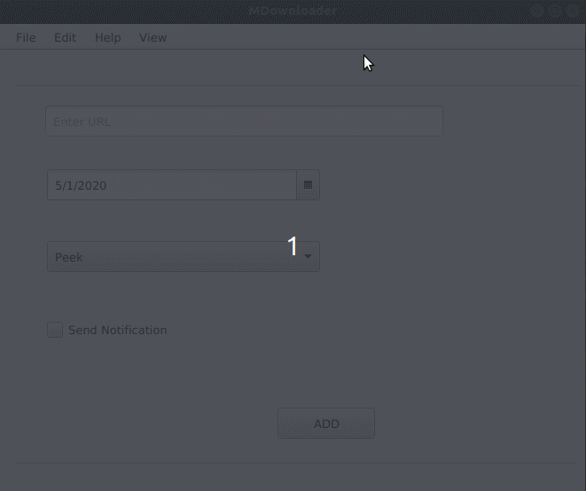

### About My Downloader

- My Downloader is a JavaFX app wich can be used to schedule downloads (video,mp3 and pdf formatted files) efficiently.
- A Bot is used to assist the users. (Help Menu)

### Some Pre-Requisites

- Please use JDK 14 to contribute for the project.
- Install sqlite3
- Install python3.6
- Install pip3

### Prview

- 

### Contribution and Installation

- git clone https://github.com/BLasan/My-Downloader.git
- mvn clean install

### Run

- Download the zip-MDownloader-ZIP.zip
- Unzip the package
- Run ./execute.sh _PATH_TO_FX_

